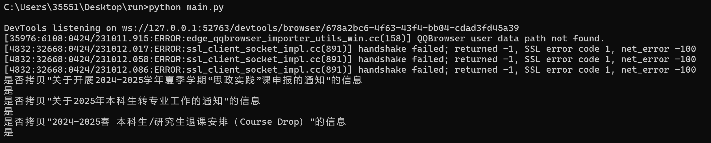
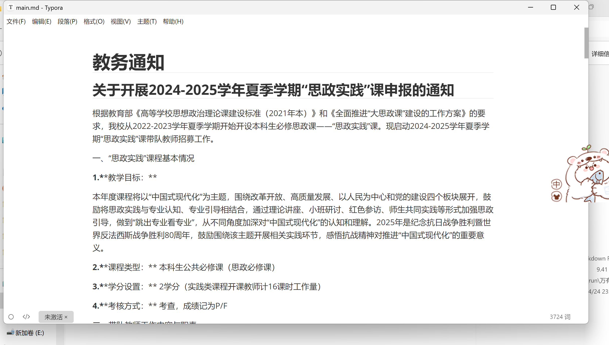

# 万有预报爬虫

这是一个用于自动爬取清华大学校内信息的工具，可以收集整理教务通知、家园网信息、图书馆信息以及新清华学堂演出信息，并将其保存为Markdown格式文档。

- 自动爬取清华大学教务通知
- 自动爬取家园网信息
- 自动爬取图书馆开馆通知和讲座信息
- 自动爬取新清华学堂演出信息（包括图片下载）
- 所有信息整合为一个Markdown文档
- 按时间戳创建文件夹，避免覆盖历史记录

## Run
调用的库在`requirements.txt`中，使用`pip`安装即可。
```bash
python main.py
```
使用示例

| 控制台                                  | md输出                                                       |
| --------------------------------------- | ------------------------------------------------------------ |
|  |  |

## Acknowledgement
This project codebase is mainly developed by [@2007qqc](https://github.com/2007qqc)

